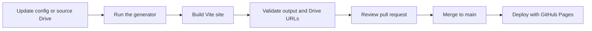

# Contributing to the portfolio

Use one focused change stream at a time. The central rule is exact reconciliation: the generated inventory, generated manifest, and rendered archive must match the current supported public Drive descendants.

## Sequential change flow



1. Make the smallest appropriate configuration, Drive, or UI change.
2. Generate media files with `npm run sync:drive`; never edit `data/drive-inventory.json` or `js/portfolio-data.js` by hand.
3. Preserve exact equality between current supported Drive IDs, inventory IDs, manifest IDs, and rendered archive IDs.
4. Run `npm run check`; run `npm run verify` before merging changes that touch content or media URLs.
5. Confirm keyboard operation, dialog focus return, reduced-motion behavior, and mobile layout in a browser.
6. Merge through a pull request. After merge, run **Update & publish portfolio** (or **Deploy GitHub Pages**) if the change was UI-only; media syncs publish automatically via that workflow.

## Visual-system rules

- Keep the cool technical palette, concise type scale, and intentional density. Add meaningful information before decorative chrome.
- Use only the design tokens in `src/styles/tokens.css` for recurring colors, spacing, and type decisions.
- Keep autoplay off. Images are lazy by default; only selected-work imagery may be eager.
- Keep social controls as SVG icons with an accessible `aria-label`; do not regress them to visible text labels.
- Do not use `innerHTML` for manifest-supplied content. The social SVG strings are the sole static, locally owned exception.

## Commands

```sh
npm ci
npm run test
npm run build
npm run verify:dist
npm run verify
```

## Deployment

GitHub Pages is deployed from `.github/workflows/deploy-pages.yml`. Media reconciliation and publish are owned by `.github/workflows/update-portfolio.yml` (nightly + manual). It opens and merges a scoped generated-data PR when needed, then calls the reusable Pages workflow. Manual runs default to force publish so one click still redeploys when Drive did not change. The `vite.config.js` `base` value must remain `/portfolio/` unless the Pages URL itself is intentionally changed. Deployment uploads the immutable `dist/` build artifact and finishes with live Playwright acceptance.
