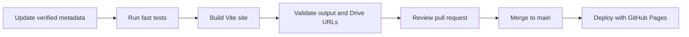

# Contributing to the portfolio

Use one focused change stream at a time. This portfolio’s central rule is preservation: visual refreshes may change hierarchy and presentation, but must not remove a verified work item.

## Sequential change flow



1. Make the smallest appropriate data or UI change.
2. If media changes, update `data/drive-inventory.json` and `js/portfolio-data.js` together.
3. Preserve the invariant that every inventory Drive ID appears exactly once in the manifest and archive.
4. Run `npm run check`; run `npm run verify` before merging changes that touch content or media URLs.
5. Confirm keyboard operation, dialog focus return, reduced-motion behavior, and mobile layout in a browser.
6. Merge through a pull request. The Pages workflow deploys `main`.

## Visual-system rules

- Keep the cool technical palette, concise type scale, and intentional density. Add meaningful information before decorative chrome.
- Use only the design tokens in `src/styles/tokens.css` for recurring colors, spacing, and type decisions.
- Keep autoplay off. Images are lazy by default; only selected-work imagery may be eager.
- Keep social controls as SVG icons with an accessible `aria-label`; do not regress them to visible text labels.
- Do not use `innerHTML` for manifest-supplied content. The social SVG strings are the sole static, locally owned exception.

## Commands

```sh
npm ci
npm run test
npm run build
npm run verify:dist
npm run verify
```

## Deployment

GitHub Pages is deployed from the Actions workflow in `.github/workflows/deploy-pages.yml`. The `vite.config.js` `base` value must remain `/portfolio/` unless the Pages URL itself is intentionally changed. Deployment never writes to the repository’s source branch; it uploads the immutable `dist/` build artifact.
