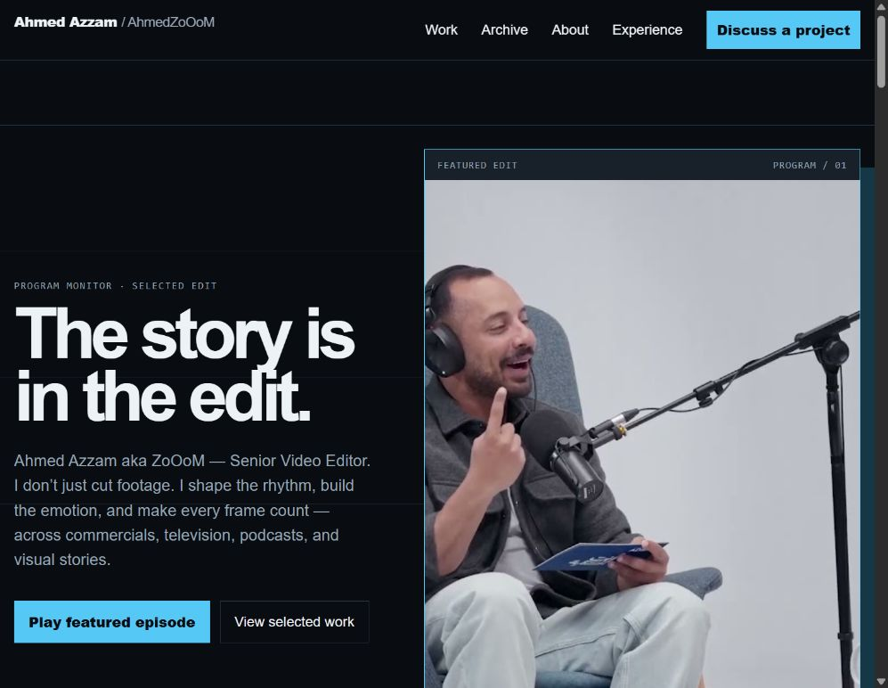
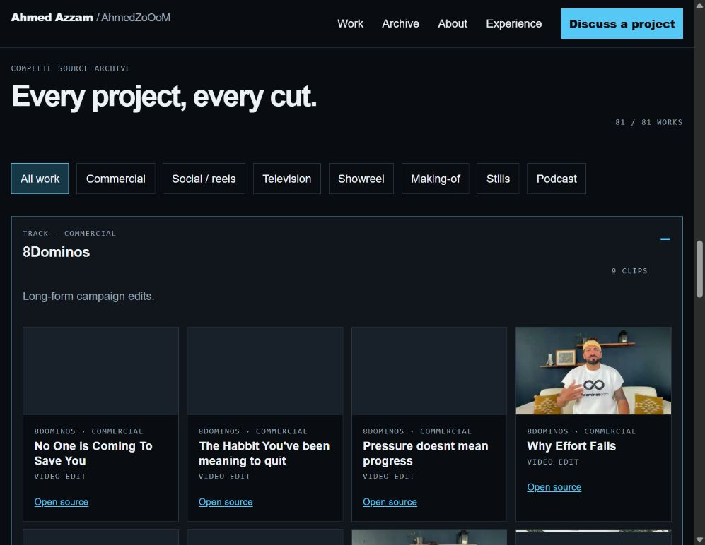
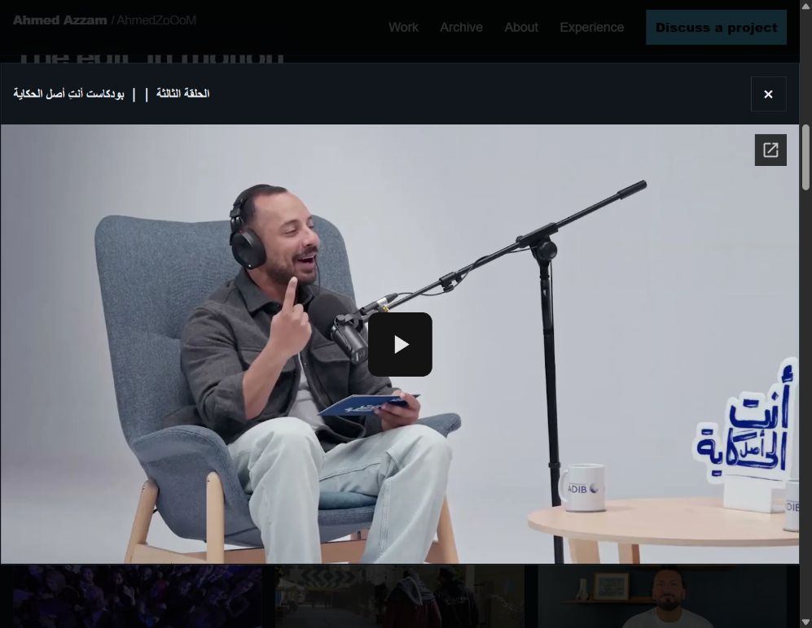
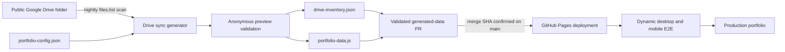
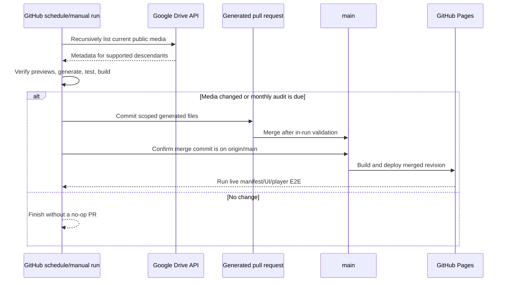

# Ahmed Azzam — Senior Video Editor Portfolio

The source for [Ahmed Azzam’s live portfolio](https://ahmedzooom.github.io/portfolio/): a fast, accessible Vite site that presents selected work and the complete public Google Drive media archive without copying the original videos into Git.

The portfolio is designed for producers, agencies, and collaborators. Media stays current automatically: a nightly GitHub Actions workflow reconciles the public Drive tree, validates every preview, merges a generated-data pull request when needed, deploys GitHub Pages, and tests the finished production site.



## What visitors get

- A concise editorial introduction and selected-work sequence.
- A filterable archive whose categories come from the current generated data.
- Native Google Drive playback on demand—no autoplay and no duplicate custom video controls.
- Responsive layouts, keyboard-friendly controls, focus return after closing media, reduced-motion support, and readable fallback states.
- Direct contact details and verified social profiles.

The selected list, archive totals, filters, and empty states are data-driven. The repository does not assume a permanent number of files or categories.

<details>
<summary>See the live archive and player</summary>





</details>

## How media reaches production



The completion invariant is exact ID equality:

```text
current supported Drive descendants = generated inventory = generated manifest = rendered archive
```

Adding a public image or video to the source tree adds it on the next successful sync. Deleting or trashing it removes it. The generator consumes every Drive result page, recurses through folders, rejects incomplete searches, and writes nothing if metadata or anonymous playback validation fails.

### Category rules

Category ownership lives in [`data/portfolio-config.json`](data/portfolio-config.json), not in UI components. Rules are deterministic:

1. Images are `stills`.
2. Locked folder mappings win—for example, `Automatest` and `Enty Asl El Hekaya` are podcasts.
3. Showreel and making-of filename signals are applied.
4. Known folder defaults or configured inference rules are used.
5. Unknown content falls back to `other` and remains visible.

Folder aliases cover the bilingual names currently used in Drive. Add an alias or mapping in configuration when a source folder is renamed; do not patch generated files by hand.

## Nightly automation

[`sync-drive-media.yml`](.github/workflows/sync-drive-media.yml) runs every night at **00:17 UTC** and can also be started manually.



- The API key is read only from the repository secret `GOOGLE_DRIVE_API_KEY` and is restricted in Google Cloud to the Google Drive API.
- The sync job has scoped content and pull-request permissions. Pages deployment and failure reporting use separate least-privilege jobs.
- The first healthy no-content-change run each month updates `data/drive-sync-audit.json`, producing a small audit PR so scheduled automation remains observable.
- Repeated failures update one open `[automation] Nightly Drive sync failed` issue instead of creating duplicates.
- The workflow does not depend on GitHub’s repository auto-merge setting; it validates, merges, and proves the merge SHA is present on `main` before deployment.

## Repository guide

| Path | Purpose |
| --- | --- |
| `index.html` | Semantic page shell, metadata, structured data, and dialog mount points. |
| `src/main.js` | Composes the page from generated portfolio data. |
| `src/components/` | Archive, media cards, native Drive dialog, and social-link renderers. |
| `src/data/portfolio-data.js` | Thin adapter that enriches the generated browser manifest for components. |
| `src/styles/` | Design tokens, base rules, layout, components, and responsive behavior. |
| `src/assets/` | Small local presentation assets, including the approved profile portrait. |
| `data/portfolio-config.json` | Human-maintained source folder, taxonomy, featured policy, profile, and social configuration. |
| `data/drive-inventory.json` | Generated exact snapshot of supported current Drive media and preview-verification status. |
| `data/drive-sync-audit.json` | Month of the last healthy audit PR. |
| `js/portfolio-data.js` | Generated canonical browser manifest; never edit manually. |
| `scripts/sync-drive-media.mjs` | Recursive Drive scanner, public-preview validator, taxonomy mapper, and deterministic generator. |
| `scripts/*.test.mjs` | Fast unit and repository contract tests. |
| `scripts/verify-portfolio.mjs` | Exact inventory/manifest and live provider validation. |
| `scripts/verify-dist.mjs` | Built-artifact contract verification. |
| `scripts/verify-live-media.mjs` | Lightweight post-deploy asset and Drive-player check. |
| `tests/portfolio.e2e.spec.mjs` | Desktop/mobile production acceptance derived from the deployed manifest. |
| `playwright.config.mjs` | Playwright browser, retry, trace, and local-preview configuration. |
| `.github/workflows/quality.yml` | Pull-request and `main` quality gate. |
| `.github/workflows/deploy-pages.yml` | Reusable Pages build, deploy, provider check, and final E2E workflow. |
| `.github/workflows/sync-drive-media.yml` | Nightly Drive reconciliation, PR merge, audit, deployment, and failure tracking. |
| `public/` | Favicon, social preview artwork, sitemap, and robots policy copied into the build. |
| `docs/images/` | Screenshots captured from the deployed production site for this README. |
| `vite.config.js` | Vite configuration, including the `/portfolio/` GitHub Pages base path. |
| `package.json` / `package-lock.json` | Reproducible Node scripts and dependencies. |
| `CONTRIBUTING.md` | Focused contribution and validation workflow. |
| `AGENTS.md` | Repository-specific guidance for coding agents. |
| `PORTFOLIO_REAL_CONTENT_PLAN.md` | Historical content-integration plan retained for context. |

Legacy `css/` and `js/script.js` files remain as historical static-site material; the production entry point is `src/main.js`, and Vite bundles only the current module graph.

## Local development

Requirements: a current Node.js LTS release and npm.

```sh
npm ci
npm run dev
```

Vite serves the development site. The production bundle uses the `/portfolio/` base path because the site is hosted from a GitHub project page.

Useful commands:

| Command | What it proves |
| --- | --- |
| `npm run test` | Sync, taxonomy, UI, workflow, privacy, player, and responsive contracts. |
| `npm run build` | Creates the production Vite bundle in ignored `dist/`. |
| `npm run verify:dist` | Checks the built bundle’s paths and required assets. |
| `npm run verify` | Reconciles inventory/manifest structure and verifies Drive preview/poster URLs with retries. |
| `npm run check` | Runs fast tests, build, and distribution verification together. |
| `npm run test:e2e` | Runs Playwright; locally it starts the built preview, while deployment supplies `PLAYWRIGHT_BASE_URL`. |
| `npm run sync:drive` | Rebuilds generated inventory and manifest using `GOOGLE_DRIVE_API_KEY`. |
| `npm run sync:drive:check` | Proves the generated files match the current Drive tree without rewriting them. |

For a local E2E run:

```sh
npm run build
npx playwright install chromium
npm run test:e2e
```

## Updating content or presentation

### Media and categories

1. Add, rename, move, or delete media in the public source Drive folder.
2. Update `data/portfolio-config.json` only if taxonomy, aliases, featured policy, profile facts, or social links changed.
3. Run the sync locally with the restricted API key, or dispatch **Sync Google Drive media** in Actions.
4. Review the generated PR. Never hand-edit `drive-inventory.json` or `portfolio-data.js`.

### UI work

Start from the rendered flow, change the owning module under `src/`, and keep native Drive controls, keyboard behavior, responsive layout, and empty/error states intact. Run `npm run check`; use `npm run verify` for any content or provider change.

## Deployment and acceptance

Merging to `main` runs the reusable Pages workflow:

1. install locked dependencies;
2. run all local checks and provider verification;
3. upload and deploy the immutable `dist/` artifact;
4. verify the live bundle and native Drive player contract;
5. install Chromium and run dynamic desktop/mobile E2E against the deployment URL.

The E2E reads `window.PORTFOLIO_DATA` from the deployed bundle and compares it with rendered IDs, filters, counts, and player behavior. It contains no exact current media count, Drive ID, or category inventory.

## Security, privacy, and rights

- Never commit the Drive API key. Store it only as `GOOGLE_DRIVE_API_KEY` in GitHub Actions or a temporary local environment variable.
- The API key is suitable only for public metadata access and must remain restricted to Google Drive API calls. It does not grant private Drive access.
- Only professional profile information and verified project metadata are published. Raw CV material and private personal facts are excluded.
- Videos remain on Google Drive and are loaded only after a visitor asks to play one.
- Project and client rights remain with their respective owners; work is shown for professional demonstration.

## Troubleshooting

- **A file is missing after sync:** confirm it is a supported `image/*` or `video/*` descendant, not trashed, and anonymously previewable.
- **Sync reports an incomplete search or preview failure:** no generated files are replaced. Fix Drive visibility or retry after a transient provider error.
- **A folder has the wrong label:** add the exact folder name as an alias or mapping in `portfolio-config.json`, then regenerate.
- **A scheduled run fails:** use the linked Actions run in the deduplicated automation issue; a successful rerun should be followed through deployment and live E2E.
- **Local Pages paths look wrong:** build and use `npm run preview`; opening `dist/index.html` directly bypasses the `/portfolio/` base path.

See [CONTRIBUTING.md](CONTRIBUTING.md) for the compact contributor checklist and [tracker #14](https://github.com/AhmedZoOoM/portfolio/issues/14) for the implementation acceptance record.
