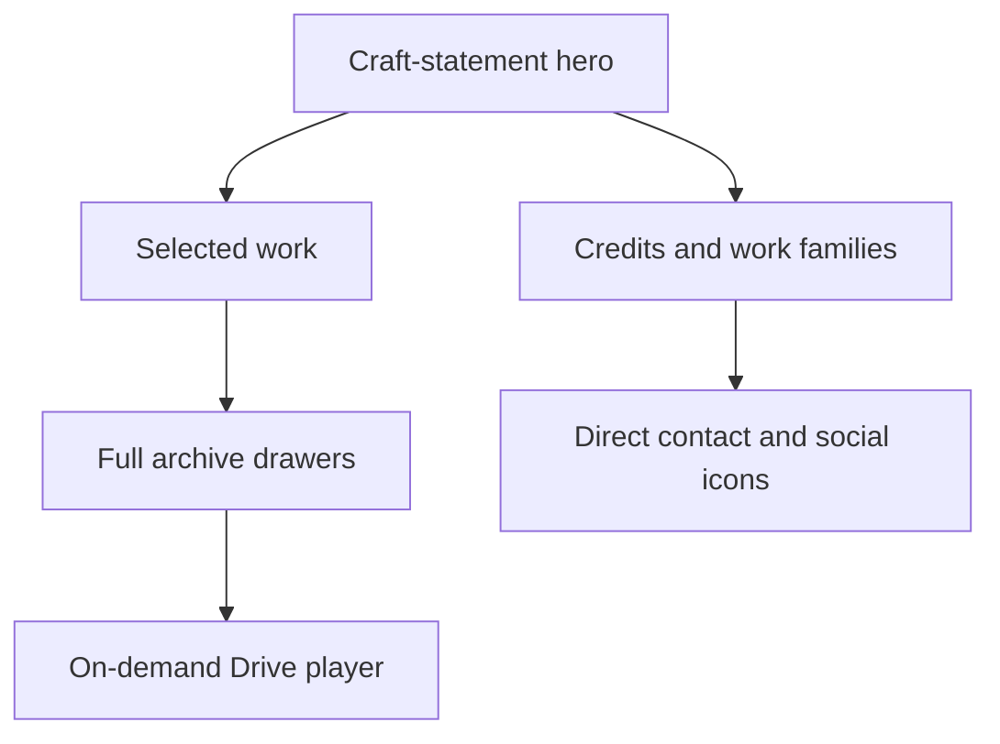

# Ahmed Azzam — Editor Portfolio

A sleek, dark, timeline-canvas portfolio for Ahmed Azzam (AhmedZoOoM), built for producers and agencies evaluating narrative editing work.

The site is published at [ahmedzooom.github.io/portfolio](https://ahmedzooom.github.io/portfolio/). It keeps every verified item in the original archive while making the editorial story, selected work, credits, and direct-contact path easier to scan.

## Experience architecture



- **Hero:** interactive poster treatment with an explicit play action; it never autoplays.
- **Selected work:** six deliberately ordered pieces, including the featured podcast episode and BTS ADIB.
- **Archive:** filterable native disclosure drawers that preserve all 81 media items.
- **Playback:** an iframe is created only after a viewer chooses a video, then removed on close.
- **Conversion:** a direct contact panel and icon-only social links with accessible labels.

## Content source of truth

- `data/drive-inventory.json` is the saved source scan.
- `js/portfolio-data.js` is the canonical browser manifest and maps every scanned media Drive ID once.
- `src/data/portfolio-data.js` adapts that manifest for the Vite UI; it must not create a second media catalogue.
- Media remains in [the canonical Google Drive folder](https://drive.google.com/drive/folders/1M-fwHszneqa2h0xoZhImtVKoBZdmAMP9); this repository contains no copied video files.

The completion invariant is exact ID equality: Drive inventory = manifest = rendered archive. Do not omit alternate exports, grouped variants, reels, or stills.

## Local development

```sh
npm ci
npm run dev
```

Use `npm run build` for the production bundle and `npm run preview` to inspect that bundle locally. The project uses the `/portfolio/` Vite base because GitHub Pages is hosted under the repository path.

## Validation

```sh
npm run test
npm run build
npm run verify:dist
npm run verify
```

`npm run check` runs the fast content, build, and distribution checks. `npm run verify` additionally validates all manifest Drive preview/poster URLs with bounded concurrency and retry behavior.

## Project map

```text
src/
  components/        Rendering, archive, dialog, and social-icon modules
  data/              Manifest adapter
  styles/            Tokenized responsive visual system
  main.js            Application composition
public/              Favicon, social-preview art, robots, sitemap
scripts/             Content, build, and deployment-contract verification
.github/workflows/   Quality gate and GitHub Pages deployment
```

## Privacy and rights

Only CV-derived professional information and verified project metadata are published. The raw CV and private personal details are excluded. Caption availability is represented per item without overstating accessibility. Work is shown for professional demonstration; project and client rights remain with their respective owners.

See [CONTRIBUTING.md](CONTRIBUTING.md) for the sequential implementation and content-update workflow.
